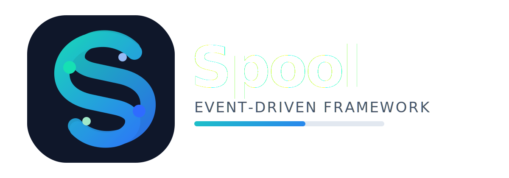

<p align="center">
    
</p>

# Spool Watchdog

The official standalone monitoring service for the **Spool Framework**.

The Watchdog is designed to be deployed as a completely independent piece of infrastructure. It keeps track of active Spool modules (like Crawlers, Feeders, or Ingesters), detects degraded instances when heartbeats stop arriving, and provides real-time state visibility.

Built as a lightweight Java application, **it is distributed as a ready-to-use Docker image** so users can drop it into their architecture without worrying about the underlying code.

> [!NOTE]
> The Watchdog relies on a "Push Model": modules proactively send heartbeats to the Watchdog. It does not attempt to restart modules on its own—that responsibility is delegated to the orchestrator (e.g., Kubernetes, Docker Swarm, or AWS ECS).

---

## Table of Contents
1. [Quickstart](#quickstart)
2. [How it works](#how-it-works)
3. [Configuration](#configuration)
4. [HTTP API](#http-api)
5. [Observability (OpenTelemetry)](#observability-opentelemetry)
6. [Local Development](#local-development)
7. [License](#license)

---

## Quickstart

The fastest way to get the Watchdog running is by using the official public Docker image. You don't need to build anything.

### Option A: Docker CLI

```bash
docker run -d \
    --name spool-watchdog \
    -p 8090:8080 \
    -e MODULE_TIMEOUT_SECONDS=30 \
    -e ZOMBIE_TIMEOUT_SECONDS=300 \
    spoolframework/spool-watchdog:latest
```

### Option B: Docker Compose (Recommended)

Add the Watchdog alongside your other Spool modules in your `docker-compose.yml`:

```yaml
services:
    watchdog:
        image: spoolframework/spool-watchdog:latest
        container_name: spool-watchdog
        ports:
          - "8090:8080"
        environment:
            - WATCHDOG_PORT=8080
            - MODULE_TIMEOUT_SECONDS=30
            - ZOMBIE_TIMEOUT_SECONDS=300
        healthcheck:
        test: ["CMD", "wget", "-qO-", "http://localhost:8080/health"]
        interval: 30s
        timeout: 5s
        retries: 3
```

Run it with:
```bash
docker-compose up -d watchdog
```

---

## How it works

1. **Registration**: When a Spool module starts, it sends an initial HTTP heartbeat to the Watchdog.
2. **Monitoring**: The Watchdog stores the module in its internal Registry and records the timestamp.
3. **Degradation**: If a module fails to send a heartbeat within the `MODULE_TIMEOUT_SECONDS`, its status is updated to `DEGRADED`.
4. **Zombie Cleanup**: If the silence persists past `ZOMBIE_TIMEOUT_SECONDS`, the module is considered dead and is purged from the registry.

---

## Configuration

You can customize the Watchdog behavior entirely through Environment Variables passed to the Docker container. No code changes required.

| Environment Variable | Description | Default Value |
|----------------------|-------------|---------------|
| `WATCHDOG_PORT` | The internal port where the HTTP server listens. | `8080` |
| `MODULE_TIMEOUT_SECONDS` | Time without a heartbeat before a module is marked `DEGRADED`. | `30` |
| `ZOMBIE_TIMEOUT_SECONDS` | Time without a heartbeat before a module is removed permanently. | `300` (5 mins) |
| `SERVICE_NAME` | OpenTelemetry identifier for this service. | `spool-watchdog` |
| `OTEL_LOGS_ENDPOINT` | OTLP endpoint for exporting logs. | `http://host.docker.internal:3100/otlp/v1/logs` |
| `OTEL_TRACES_ENDPOINT` | OTLP endpoint for exporting distributed traces. | `http://host.docker.internal:4318/v1/traces` |

> [!TIP]
> Make sure the `WATCHDOG_PORT` matches the port exposed by your Docker container (e.g., `EXPOSE 8080` in the Dockerfile).

---

## HTTP API

The Watchdog exposes a minimal HTTP interface for framework interoperability.

### 1. Send Heartbeat (Called by Modules)

```http
POST /heartbeat
Content-Type: application/json
```

**Request Body:**
```json
{
    "identity": {
        "name": "sec-crawler",
        "instanceId": "crawler-node-01"
    },
    "status": "HEALTHY"
}
```

**Response:** `204 No Content`

### 2. Query Global Health (Called by Dashboards/Admins)

Returns a snapshot of all currently registered modules and their states.

```http
GET /health
```

**Response:** `200 OK`
```json
[
    {
        "identity": { "name": "sec-crawler", "instanceId": "crawler-node-01" }, 
        "status": "HEALTHY", "lastSeen": "2026-04-15T18:30:00Z"
    },
    {
        "identity": { "name": "data-ingester", "instanceId": "ingester-node-02" },
        "status": "DEGRADED",
        "lastSeen": "2026-04-15T18:29:15Z"
    }
]
```

---

## Observability (OpenTelemetry)

The Watchdog is built with **OpenTelemetry (OTEL)** native integration. It acts as an observer and emits valuable lifecycle events into your tracing/logging stack (like Grafana, Tempo, or Loki).

It automatically generates traces and metrics for:
- Module startups.
- MTTR (Mean Time To Recovery) after failures.
- Module degradation and zombie evictions.

To use this, simply point the `OTEL_TRACES_ENDPOINT` and `OTEL_LOGS_ENDPOINT` to your OTEL Collector.

> [!WARNING]
> If the OTEL endpoints are unreachable, the Watchdog will still function normally, but telemetry data will be silently dropped.

---

## Local Development

If you want to contribute to the Watchdog core or run it locally without Docker:

**1. Build the `.jar` executable:**
```bash
mvn clean package -DskipTests
```

**2. Run the application:**
```bash
java -jar target/watchdog.jar
```

**3. Build a local Docker image:**
```bash
docker build -t watchdog-local .
```

---

## License

Licensed under the [Apache License, Version 2.0](https://www.apache.org/licenses/LICENSE-2.0.txt).